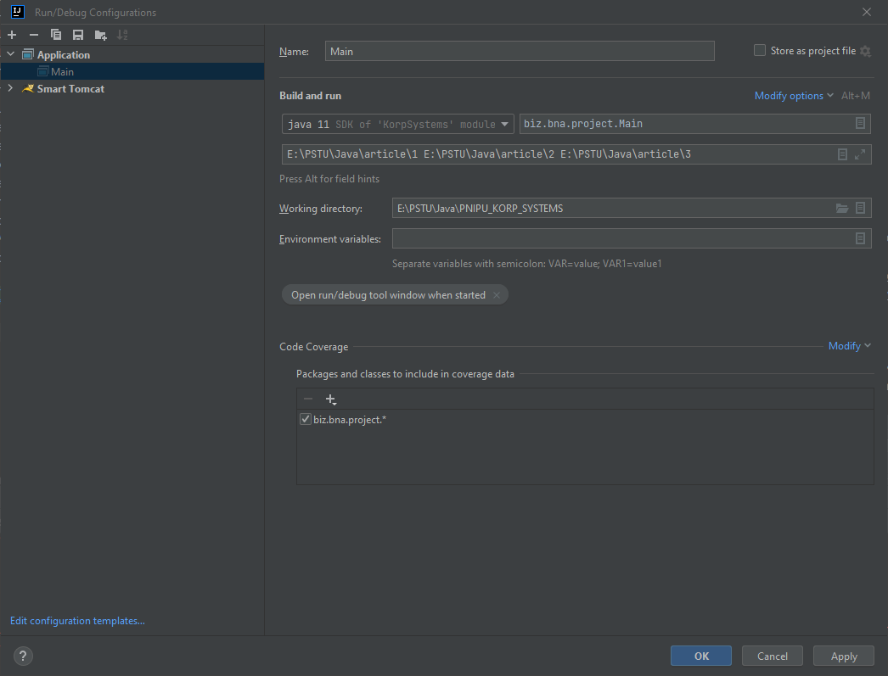
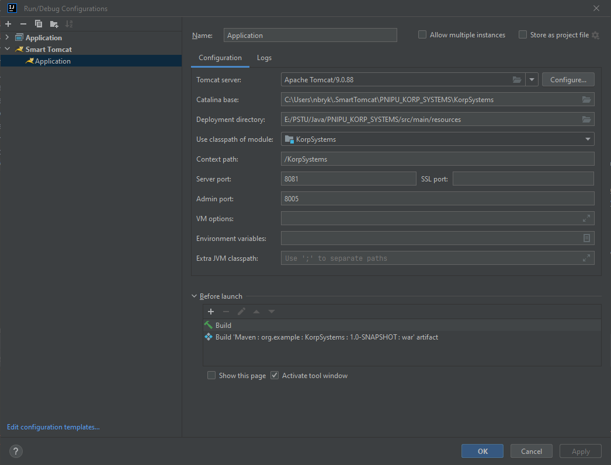

<h1>Прототип браузера</h1>
Данное приложение представляет собой урезанную версию браузера. 
Оно состоит из двух частей: 
<li> Счётчик слов и загрузка данных в БД
<li> Поисковая строка с поиском документов
<h3>Счётчик слов</h3>
Для воспроизведения алгоритма подсчета слов необходимо из каталога 
<u>src/main/resources</u> разархивировать файл article.jar и указать во время
запуска класса Main путь к трем подкаталогам данного архива. Количество для подсчета потоков - 3.
Реализована возможность варьировать количество от 1 до 4-х потоков. Для подсчета вхождения обрезаются некоторые части 
слова 
Скрипт для создания базы данных находится в <u>src/main/resources/script.sql</u>.
Сам коннект находится в <u>src/main/java/biz/bna/project/utils/DatabaseUtils.java</u>. 
Итоговая конфигурация выглядит следующим образом

<h3>Браузер</h3>
После загрузки данных в бд необходимо создать TomCat приложение с версией TomCat 9.0.88 
(Можно скачать прямо из IntellijIDEA).
Примерная конфигурация в итоге выглядит следующим образом  

Слово для проверки работоспособности алгоритма: <b>Лекция</b>